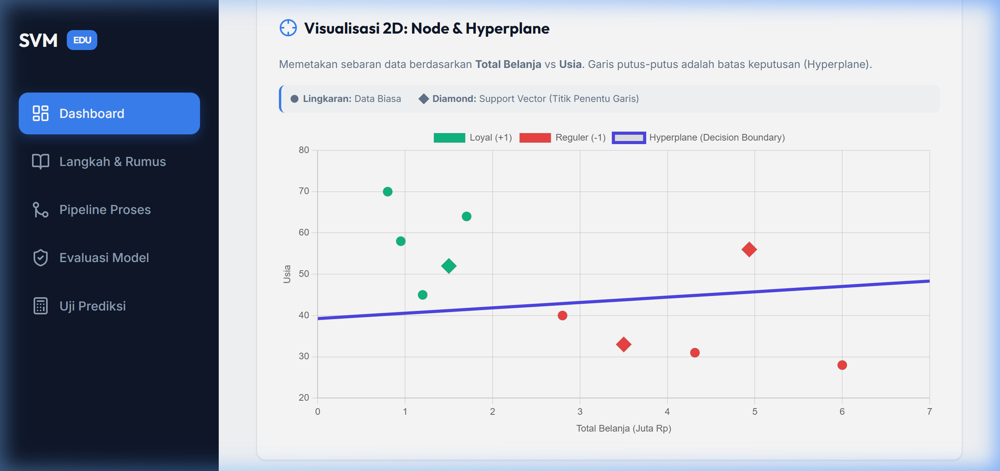

# SVM Academic Dashboard 🎓📊


Sebuah aplikasi web interaktif berbasis Flask yang dirancang untuk membantu mahasiswa dan civitas akademika memahami algoritma **Support Vector Machine (SVM)** secara visual dan matematis.

## ✨ Fitur Utama

- **Dashboard Interaktif**: Visualisasi sebaran data pelanggan menggunakan Chart.js.
- **2D Decision Boundary**: Pemetaan *Nodes* dan *Hyperplane* (Garis Keputusan) serta penandaan otomatis *Support Vectors*.
- **Bedah Matematika (Step-by-Step)**: Trase kalkulasi *dot product* dan penambahan *bias* untuk klasifikasi setiap data sampel.
- **Teori Lagrange Multipliers**: Penjelasan mendalam mengenai *Dual Optimization Problem* yang digunakan untuk menemukan bobot optimal.
- **Pipeline Proses**: Representasi visual alur kerja Machine Learning dari data mentah hingga output.
- **Uji Prediksi**: Antarmuka untuk mencoba klasifikasi data baru secara real-time.
- **Evaluasi Model**: Laporan akurasi lengkap dengan *Confusion Matrix* dan analisis kasus.

## 🛠️ Tech Stack

- **Backend**: Python Flask
- **Frontend**: Vanilla CSS (Modern Sidebar Design), HTML5 Semantic
- **Visualisasi**: [Chart.js](https://www.chartjs.org/)
- **Render Matematika**: [MathJax](https://www.mathjax.org/) (LaTeX support)
- **ML Logic**: NumPy, Scipy (Optimization)

## 📐 Konsep SVM yang Diimplementasikan

Proyek ini mendemonstrasikan penyelesaian **SVM Dual Problem**:

$$
\begin{aligned}
L(\alpha) &= \sum_{i=1}^{n} \alpha_i - \frac{1}{2} \sum_{i,j=1}^{n} \alpha_i \alpha_j y_i y_j (x_i \cdot x_j)
\end{aligned}
$$

Bobot ($w$) kemudian dikonstruksi dari pengali Lagrange ($\alpha$):

$$ w = \sum_{i=1}^{n} \alpha_i y_i x_i $$

## 🚀 Cara Menjalankan

1. Clone repository ini.
2. Instal dependensi:
   ```bash
   pip install flask numpy scipy
   ```
3. Jalankan aplikasi:
   ```bash
   python app.py
   ```
4. Buka di browser: `http://127.0.0.1:5000`

## 📁 Struktur Proyek

- `app.py`: Logika utama Flask dan perhitungan SVM.
- `train_svm.py`: Script implementasi solver Lagrange Dual.
- `templates/`: Kumpulan tampilan dashboard dan edukasi.
- `static/`: File CSS modern dan assets.

---
**Dibuat untuk tujuan pendidikan di bidang Machine Learning.**
